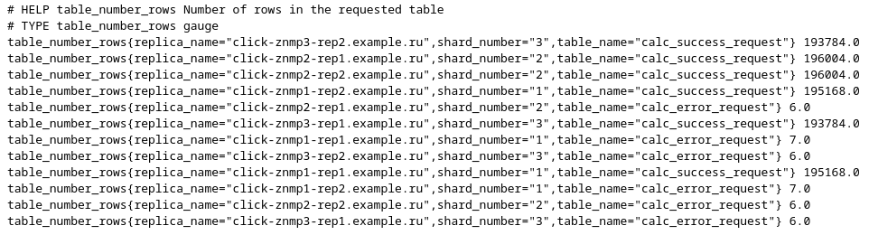

# Clickhouse exporter `log_max_index`
## _Checking the maximum record number in the general action log for a table_
- To check the length of the action log in different replicas of the same shard;
- Send the data to Prometheus.

  


## Configuration

Edit the configuration file `config.yml` and specify the structure of your shards and the replicas serving them. For example:
```yml
---
example_database_name:
  example_table_name: 
    1:
      - click-znmp1-rep1.example.ru:8123
      - click-znmp1-rep2.example.ru:8124
    2:
      - click-znmp2-rep1.example.ru:8123
      - click-znmp2-rep2.example.ru:8124
    3:
      - click-znmp3-rep1.example.ru:8123
      - click-znmp3-rep2.example.ru:8124
  example_table_name_2: 
    1:
      - click-znmp1-rep1.example.ru:8123
      - click-znmp1-rep2.example.ru:8124
    2:
      - click-znmp2-rep1.example.ru:8123
      - click-znmp2-rep2.example.ru:8124
    3:
      - click-znmp3-rep1.example.ru:8123
      - click-znmp3-rep2.example.ru:8124
```
Create a `.credentials.txt` file and specify the data for authorization in Clickhouse. The user must have read access to the table. For example:
```
user:examplepassword123
```

# Launch
Run the executable `install.sh`. This script will check for the presence of the `.credentials.txt` file, build the exporter image and run it.

# Availability check
Open resource address: `http://<exporter_ip_address>:9091/metrics`

# Example of docker-compose file
```yml
  click-index-exporter:
    container_name: click-index-exporter
    hostname: click-index-exporter
    image: click-index-exporter
    restart: always
    ports:
      - 9091:9091
    volumes:
      - "${PWD}/click-index-exporter/config.yml:/click-index-exporter/config.yml"
      - "${PWD}/click-index-exporter/.credentials:/click-index-exporter/.credentials"
    networks:
      - ch_net
```

# Example of displaying metrics in Prometheus

